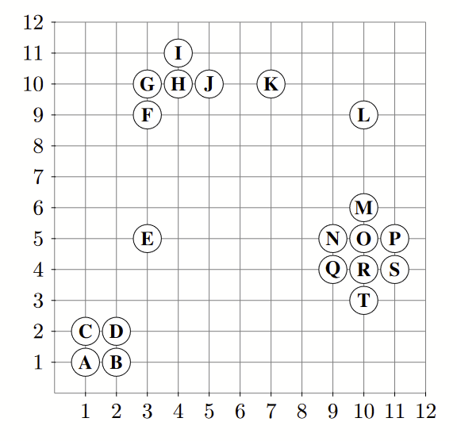

_Exercise assignment for the course [Unsupervised and Reinforcement Learning (AAI-URL)](https://inf-git.fh-rosenheim.de/aai-url/hsro-aai-url-github-io) in the [Bachelor of AAI](https://www.th-rosenheim.de/en/technology/computer-science-mathematics/applied-artificial-intelligence-bachelors-degree) at [Rosenheim University of Applied Sciences](http://www.th-rosenheim.de)_

# Assigment 02 - Python, Neighborhood, and DBSCAN

> As usual: The solution is available in branch "musterloesung"!

## Task 1 - DBSCAN

Given the following data set:

As a distance function, use Manhattan Distance:

L1(x, y) = |x1 − y1| + |x2 − y2|

Compute DBSCAN and indicate which points are core points, border points, and noise points.

Use the following parameter settings:

- Radius ε = 1.1 and minPts = 2
- Radius ε = 1.1 and minPts = 3
- Radius ε = 1.1 and minPts = 4
- Radius ε = 2.1 and minPts = 4
- Radius ε = 4.1 and minPts = 5
- Radius ε = 4.1 and minPts = 4

## Task 2 - Comparing DBSCAN with k-means and Hierarchical Clustering

In this task, we attempted to group different wines using k-means, hierarchical clustering, DBSCAN.

The story: You are managing store inventory and have received a large shipment of wine, but the brand labels fell off the bottles during transit. Fortunately, your supplier provided you with the chemical readings for each bottle along with their respective serial numbers. 

Unfortunately, you aren't able to open each bottle of wine and taste test the difference – you must find a way to group the unlabeled bottles back together according to their chemical readings! You know from the order list that you ordered three different types of wine and are given only two wine attributes to group the wine types back together.

Find out which clustering works best. Can you achieve as silhouette score of something better than 0.59.

>Use scikit-learn kmeans, AgglomerativeClustering and DBSCAN.

These steps will help you to complete the activity:

1. Import the necessary packages.
2. Load the wine dataset (provided within this repo: [wine.csv](./wine.csv)) and check what the data looks like (short description is within [wine.names](./wine.names)).
3. Visualize the data.
4. Generate clusters using k-means, agglomerative clustering, and DSBSCAN.
5. Evaluate a few different options for DSBSCAN hyperparameters and their effect on the silhouette score.
6. Generate the final clusters based on the highest silhouette score.
7. Visualize clusters generated using each of the three methods.
